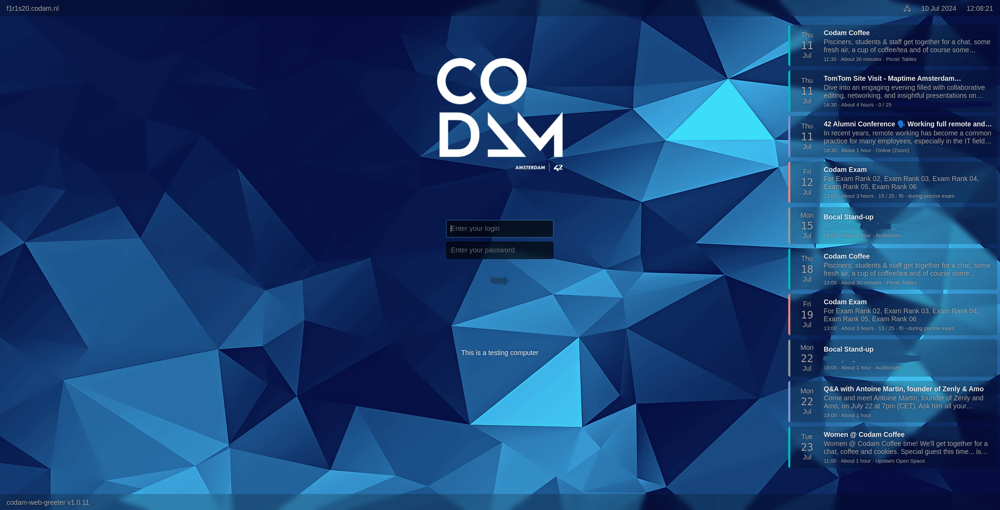

# Codam Web Greeter
A greeter theme for [nody-greeter](https://github.com/JezerM/nody-greeter)/web-greeter in LightDM, made specifically for [Codam Coding College](https://codam.nl/en).

---

## Features

- Responsive design
- Display upcoming events and exams from the Intranet
- Prevent students from signing in with their regular account during exams
- Greeter can be used as a lock screen when someone is already logged in (replacement for ft_lock)
- Customizable background images


## Screenshots



## Installation

> Caution: make sure you know how to restore your system if something goes wrong. This theme is made specifically for Codam and if it doesn't work elsewhere, you're on your own.

1. Install dependencies:
```bash
sudo apt install lightdm light-locker xprintidle
```

2. Install *nody-greeter*:
```bash
sudo apt install nody-greeter=1.5.2
```
Alternatively, you can install it by compiling from source from the [nody-greeter repository](https://github.com/codam-coding-college/nody-greeter). Don't forget to clone the repository with the `--recursive` flag to include the submodules.

3. Clone this repository
```bash
git clone https://github.com/codam-coding-college/codam-web-greeter
```

4. Build & install the greeter theme:
```bash
cd codam-web-greeter
sudo make install
```

5. Enable the nody-greeter greeter in LightDM by editing */etc/lightdm/lightdm.conf*:
```conf
# Add the following line to the file under [SeatDefaults]:
greeter-session=nody-greeter
```

6. Enable the greeter theme in nody-greeter by editing */etc/lightdm/web-greeter.yml*:
```yml
# Replace the theme name with codam-web-greeter:
greeter:
    theme: codam
```

7. Restart LightDM:
```bash
sudo systemctl restart lightdm
```


## Troubleshooting

### Locking the screen doesn't work at all
Make sure the LightDM config allows user-switching. Add the following line to */etc/lightdm/lightdm.conf*:
```conf
[SeatDefaults]
...
allow-guest=false
allow-user-switching=true
greeter-hide-users=true
greeter-show-manual-login=true
```

Also, make sure you have the `light-locker` package installed on your system.

### Locking the screen shows the login screen
Modify the [LightDM hooks](https://www.freedesktop.org/wiki/Software/LightDM/CommonConfiguration/).

- Add the following lines to the greeter setup hook defined in */etc/lightdm/lightdm.conf*:
```bash
# Get a list of all active user sessions on the system with loginctl
USER_SESSIONS=$(/usr/bin/loginctl list-sessions --no-legend | /usr/bin/awk '{print $3}')

# Loop over all sessions and cache them with dbus-send
# This is required for the codam-web-greeter and other lock screens to work properly (fetch the list of users)
for USER in $USER_SESSIONS; do
	# Cache the user
	/usr/bin/dbus-send --system --print-reply --type=method_call --dest=org.freedesktop.Accounts /org/freedesktop/Accounts org.freedesktop.Accounts.CacheUser string:"$USER" || true
done
```

- Add the following lines to the logout hook defined in */etc/lightdm/lightdm.conf*:
```bash
# Uncache the user
/usr/bin/dbus-send --system --print-reply --dest=org.freedesktop.Accounts /org/freedesktop/Accounts org.freedesktop.Accounts.UncacheUser string:$USER || true
```

### LightDM's logout hook is called upon the greeter exiting and starting a user session
Add the following lines to the top of the logout hook defined in */etc/lightdm/lightdm.conf*:
```bash
# Check if the hook was called from a greeter exiting or a student session exiting
# Display :0 is used for the first greeter and gets reused for the student session.
# Display :1 is used for the second login (user switching, in fact the Codam lock screen).
# We do not allow switching users, so for :1 there is no user session
# to clean up for. Instead, the hook was called to clean up the greeter.
# No cleaning needs to be done for the greeter. So, we simply exit.
# Source: https://www.freedesktop.org/wiki/Software/LightDM/CommonConfiguration/
if [ "$DISPLAY" != ":0" ]; then
	echo "Catched greeter logout event, exiting"
	exit 0
fi
```

### My custom wallpaper or logo doesn't show up
Make sure the folders mentioned for branding in */etc/lightdm/web-greeter.yml* exist and contain the correct files.
```yaml
branding:
    background_images_dir: /usr/share/codam/web-greeter
    logo_image: /usr/share/codam/web-greeter/logo.png
    user_image: /usr/share/codam/web-greeter/user.png
```
For 42 schools, link the *ft_lock_bkg.jpg* and *login-screen.jpg* files from */usr/share/42/* to the `background_images_dir` folder. Place your campus's logo in */usr/share/42/logo.png* and a default user icon in */usr/share/42/user.png*.

### The screen blanks on the login screen
This is a known issue with LightDM. To fix it, add the following line to */etc/lightdm/lightdm.conf*:
```conf
[SeatDefaults]
...
display-setup-script=/usr/bin/xset s off
```
Alternatively, `/usr/bin/xset s off` can be added to the greeter setup hook defined in */etc/lightdm/lightdm.conf*.

### The screen blanks on the lock screen
Best solution: use `dm-tool switch-to-greeter` instead of `dm-tool lock` to lock the screen.

Alternatively, add the following line to the greeter setup hook defined in */etc/lightdm/lightdm.conf*:
```bash
/usr/bin/xset dpms force off
```
However, this will cause the login screen to blank instead.

### Rebooting doesn't work in the lock screen
Check if rebooting from the *lightdm* user is allowed by PolKit. For example, add the following lines to */etc/polkit-1/localauthority/20-org.d/org.freedesktop.login1.pkla*:
```conf
[Enable reboot by default for lightdm user]
Identity=unix-user:lightdm
Action=org.freedesktop.login1.reboot;org.freedesktop.login1.reboot-multiple-sessions;org.freedesktop.login1.reboot-ignore-inhibit;
ResultAny=yes
ResultInactive=yes
ResultActive=yes
```

### The power button powers off the system when the greeter is active
Modify the logind configuration on what to do when the power button is pressed. For example, add the following lines to */etc/systemd/logind.conf*:
```conf
[Login]
...
HandlePowerKey=ignore
HandleSuspendKey=ignore
HandleHibernateKey=ignore
```
Don't forget to restart logind after modifying: `sudo systemctl restart systemd-logind`
